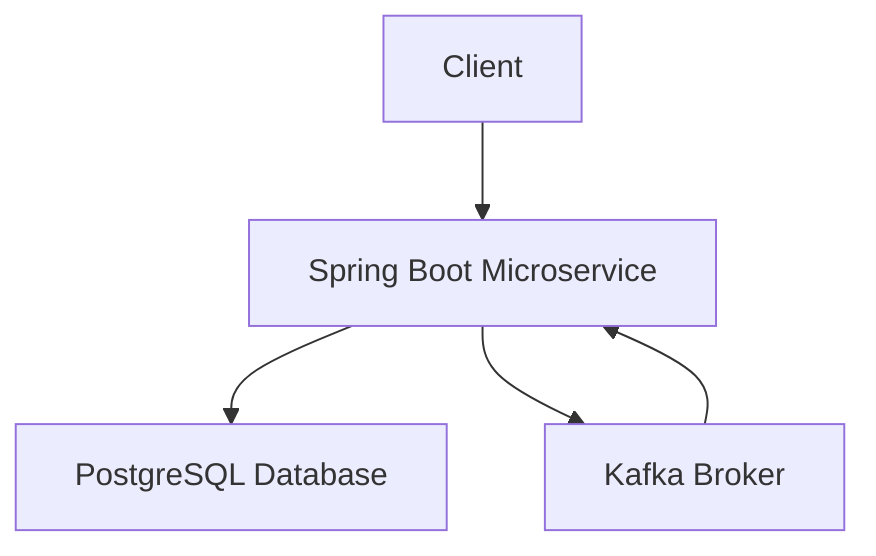

# Spring Boot Microservice

A simple Spring Boot microservice for managing users, featuring REST API, database integration, and Kafka messaging.

## Architecture



The microservice provides CRUD operations for users, stores data in PostgreSQL, and uses Kafka for asynchronous messaging.

## Technologies Used

- **Spring Boot 3.2.0**: Framework for building the application
- **Java 17**: Programming language
- **PostgreSQL**: Relational database
- **Kafka**: Message broker
- **Spring Data JPA**: ORM for database operations
- **Spring Kafka**: Integration with Kafka
- **SpringDoc OpenAPI**: API documentation (Swagger UI)

## Prerequisites

- Docker and Docker Compose
- Java 17 (for local development)
- Maven 3.6+ (for local development)

## Running with Docker

1. Clone the repository
2. Navigate to the project directory
3. Run `docker-compose up --build`
4. The application will be available at `http://localhost:8080`
5. API documentation at `http://localhost:8080/swagger-ui.html`

## Running Locally

1. Ensure PostgreSQL and Kafka are running locally
2. Update `application.yml` with your database and Kafka configurations
3. Run `mvn spring-boot:run`

## API Endpoints

- `GET /api/users` - Get all users
- `GET /api/users/{id}` - Get user by ID
- `POST /api/users` - Create a new user
- `PUT /api/users/{id}` - Update an existing user
- `DELETE /api/users/{id}` - Delete a user

## Configuration

The application uses environment variables for Docker deployment:

- `SPRING_DATASOURCE_URL`: Database URL
- `SPRING_DATASOURCE_USERNAME`: Database username
- `SPRING_DATASOURCE_PASSWORD`: Database password
- `KAFKA_BOOTSTRAP_SERVERS`: Kafka broker address

## Database Schema

The application creates a `user` table with the following structure:

```sql
CREATE TABLE user (
    id BIGINT AUTO_INCREMENT PRIMARY KEY,
    name VARCHAR(255) NOT NULL,
    email VARCHAR(255) NOT NULL
);
```

## Kafka Integration

The microservice includes Kafka producer and consumer services for handling messages asynchronously.